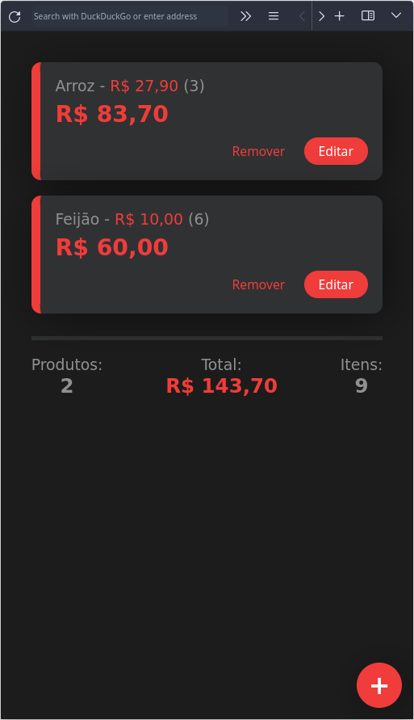

# Lista de compras

Eu fiz esse projeto para minha família gerenciar melhor o dinheiro na hora de fazer as compras, e tem funcionado muito bem. Agora meus pais conseguem gerenciar melhor o dinheiro com o que gastam quando estão fazendo compras. Tentei focar muito na interface intuitiva no que na programação em si, afinal, o projeto é feito pra meus pais. Por isso não explicar detalhadamente como ele funciona aqui, sinta-se avontade para testar. 😁

